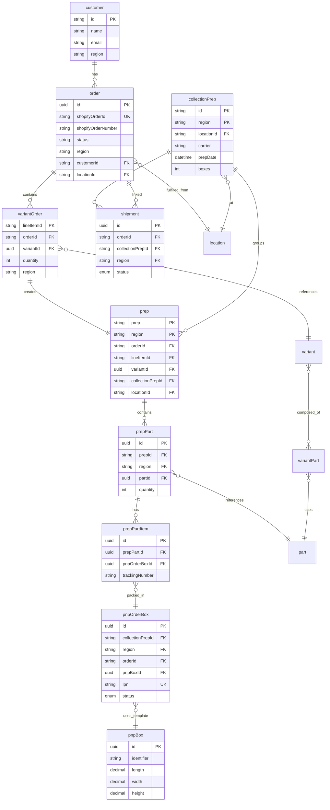

# Data Model Documentation

**Last Updated:** 2025-01-17  
**Primary Owner:** Sam Morrison

## Purpose

This document describes the database models used by the Cozey UAT Seeder, their relationships, and which models are created by the seeder versus read-only reference data.

## Overview

The seeder uses the existing WMS Prisma schema (`prisma/schema.prisma`) without requiring any schema changes. It creates coordinated test data across multiple related tables to support outbound compliance testing workflows.

## Entity Relationship Diagram

## Key Models

### Models Created by Seeder

#### `order`

**Purpose:** WMS order records linked to Shopify orders  
**Key Fields:**

- `shopifyOrderId` (unique) - Links to Shopify order
- `shopifyOrderNumber` - Human-readable order number
- `status` - Order status (e.g., "paid", "fulfilled")
- `region` - Region code (CA/US)
- `customerId` - References `customer.id`
- `locationId` - References `location.id`
- `sourceName` - Set to "wms_seed" for seed records

**Relationships:**

- One-to-many with `variantOrder`
- One-to-many with `prep`
- One-to-many with `shipment`
- Many-to-one with `customer`
- Many-to-one with `location`

#### `customer`

**Purpose:** Customer records for orders  
**Key Fields:**

- `id` (unique) - Customer identifier
- `email` (unique with region) - Customer email
- `name` - Customer name
- `region` - Region code

**Relationships:**

- One-to-many with `order`

**Idempotency:** Checked by `email` + `region` before creation

#### `variantOrder`

**Purpose:** Line item records linking Shopify line items to WMS variants  
**Key Fields:**

- `lineItemId` (unique) - Shopify line item ID (primary key)
- `orderId` - References `order.shopifyOrderId`
- `variantId` - References `variant.id`
- `quantity` - Item quantity
- `region` - Region code

**Relationships:**

- Many-to-one with `order`
- Many-to-one with `variant`
- One-to-one with `prep`

**Idempotency:** Checked by `lineItemId` (unique constraint)

#### `prep`

**Purpose:** Prep records representing fulfillment units (one per line item)  
**Key Fields:**

- `prep` + `region` (composite primary key) - Prep identifier
- `orderId` - References `order.shopifyOrderId`
- `lineItemId` - References `variantOrder.lineItemId` (unique)
- `variantId` - References `variant.id`
- `collectionPrepId` - References `collectionPrep.id` (optional)
- `locationId` - References `location.id`
- `fulfillmentStatus` - Defaults to "Open"

**Relationships:**

- Many-to-one with `order`
- One-to-one with `variantOrder`
- Many-to-one with `collectionPrep`
- One-to-many with `prepPart`

#### `prepPart`

**Purpose:** Parts within a prep (bill of materials)  
**Key Fields:**

- `id` (UUID primary key)
- `prepId` + `region` - References `prep`
- `partId` - References `part.id`
- `quantity` - Quantity of this part needed

**Relationships:**

- Many-to-one with `prep`
- Many-to-one with `part`
- One-to-many with `prepPartItem`

#### `prepPartItem`

**Purpose:** Individual items for pick-and-pack workflows  
**Key Fields:**

- `id` (UUID primary key)
- `prepPartId` - References `prepPart.id`
- `pnpOrderBoxId` - References `pnpOrderBox.id` (for PnP items)
- `trackingNumber` - Shipping tracking number
- `outboundStatus` - Status enum (PICKED, PACKED, LABEL_GENERATED, etc.)

**Relationships:**

- Many-to-one with `prepPart`
- Many-to-one with `pnpOrderBox` (for PnP items)

#### `collectionPrep`

**Purpose:** Collection prep header grouping multiple orders for collection workflows  
**Key Fields:**

- `id` + `region` (composite primary key) - Collection prep identifier
- `locationId` - References `location.id`
- `carrier` - Carrier name (e.g., "FedEx")
- `prepDate` - Collection prep date
- `boxes` - Number of boxes

**Relationships:**

- One-to-many with `prep`
- One-to-many with `shipment`
- Many-to-one with `location`

#### `shipment`

**Purpose:** Links collection prep to orders for labeling workflows  
**Key Fields:**

- `id` (UUID primary key)
- `orderId` - References `order.shopifyOrderId`
- `collectionPrepId` + `region` - References `collectionPrep`
- `status` - Enum: ACTIVE or CANCELLED

**Relationships:**

- Many-to-one with `order`
- Many-to-one with `collectionPrep`

**Unique Constraint:** `[collectionPrepId, orderId]`

#### `pnpBox`

**Purpose:** Package template definitions for pick-and-pack  
**Key Fields:**

- `id` (UUID primary key)
- `identifier` - Box identifier (e.g., "SMALL_BOX")
- `length`, `width`, `height` - Dimensions
- `lengthUnit`, `widthUnit`, `heightUnit` - Dimension units

**Note:** Typically pre-existing in database, but seeder can create if needed

#### `pnpOrderBox`

**Purpose:** Actual box instance for an order in pick-and-pack workflow  
**Key Fields:**

- `id` (UUID primary key)
- `collectionPrepId` + `region` - References `collectionPrep`
- `orderId` - References `order.shopifyOrderId`
- `pnpBoxId` - References `pnpBox.id`
- `lpn` (unique) - License plate number
- `status` - Enum: OPEN or CLOSED

**Relationships:**

- Many-to-one with `collectionPrep`
- Many-to-one with `order`
- Many-to-one with `pnpBox`
- One-to-many with `prepPartItem`

### Read-Only Reference Models

These models are used for lookups and validation but are not created by the seeder:

#### `variant`

**Purpose:** Product variants (SKU definitions)  
**Usage:** Seeder looks up variants by SKU to get `variantId` for creating `variantOrder` and `prep` records  
**Key Fields:**

- `id` (UUID primary key)
- `sku` + `region` (unique) - Stock keeping unit
- `description` - Variant description

#### `part`

**Purpose:** Parts/components that make up variants  
**Usage:** Seeder looks up parts by SKU to create `prepPart` records  
**Key Fields:**

- `id` (UUID primary key)
- `sku` + `qualityId` + `region` (unique) - Part SKU
- `pickType` - Enum: "Regular" or "Pick and Pack"
- `hasPrintedBarcode` - Boolean flag for barcode scanning

#### `location`

**Purpose:** Warehouse locations/fulfillment centers  
**Usage:** Seeder looks up locations to validate `locationId` in collection prep and order configs  
**Key Fields:**

- `id` + `region` (composite primary key)
- `name` - Location name

#### `model`, `colors`, `quality`

**Purpose:** Reference data for product catalog  
**Usage:** Used by `variant` and `part` models, not directly used by seeder

## Data Flow

### Seeding Flow

1. **Shopify Orders Created** (external to WMS)
   - Orders created in Shopify with tags for identification
   - Order IDs and line item IDs retrieved

2. **WMS Order Creation**
   - `order` record created with `shopifyOrderId`
   - `customer` record created/updated (idempotent by email + region)

3. **Line Item Processing**
   - For each Shopify line item:
     - `variantOrder` created (lookup `variant` by SKU)
     - `prep` created (one per line item)
     - `prepPart` records created (lookup `part` by SKU from `variantPart` relationships)

4. **Collection Prep Creation** (if configured)
   - `collectionPrep` header created
   - Related `prep` records updated with `collectionPrepId`
   - `shipment` records created linking orders to collection prep

5. **Pick-and-Pack Entities** (if applicable)
   - `pnpBox` templates created (if not pre-existing)
   - `pnpOrderBox` created for each order
   - `prepPartItem` records created and linked to `pnpOrderBox`

## Idempotency Strategy

The seeder is designed to be safe to re-run. Idempotency is ensured by:

1. **Unique Constraints:**
   - `order.shopifyOrderId` (unique)
   - `variantOrder.lineItemId` (unique)
   - `prep.[prep, region]` (composite unique)
   - `shipment.[collectionPrepId, orderId]` (composite unique)

2. **Lookup Before Create:**
   - Orders: Check by `shopifyOrderId`
   - Customers: Check by `email` + `region`
   - Variant orders: Check by `lineItemId`
   - If record exists, skip creation and return existing ID

3. **Transactions:**
   - Order + customer creation uses transactions for atomicity
   - Related records created in proper sequence to maintain referential integrity

## Migration Workflow

**Note:** The seeder does not require schema migrations. It uses the existing WMS Prisma schema without modifications.

If the WMS schema changes:

1. Update `prisma/schema.prisma` (this is a reference copy)
2. Run `npm run prisma:generate` to regenerate Prisma Client
3. Update seeder code if model interfaces change
4. Update this documentation if relationships change

## Related Documentation

- [Architecture Documentation](architecture.md) - System architecture overview
- [Technical Design Document](technical-design-document.md) - Detailed technical design
- [Prisma Schema](../prisma/schema.prisma) - Full database schema definition
